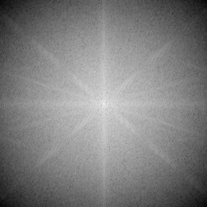

# Image Processing with Fourier Transform and Gaussian Filtering

This project demonstrates the application of a Gaussian filter in the frequency domain using Fourier transforms. The following images show the steps involved:

## Original Image

## Magnitude Spectrum After Applying Gaussian Filter

## Image After Applying Gaussian Filter

## Recovered Image After Removing Gaussian Filter

## How It Works

1. **Fourier Transform**: The original image is transformed to the frequency domain.
2. **Gaussian Filter**: A Gaussian filter is applied in the frequency domain to blur the image.
3. **Inverse Fourier Transform**: The filtered image is transformed back to the spatial domain.
4. **Removing Gaussian Filter**: The Gaussian filter is removed to attempt to recover the original image.

### Handling Numerical Stability with Epsilon

When applying a Gaussian filter in the frequency domain, high-frequency components can become very small. To reverse this filtering, we divide by the Gaussian filter, but small filter values can lead to instability and noise.

To prevent division by very small numbers, we add a small constant, **epsilon (ε)**, to the Gaussian filter. This ensures numerical stability and avoids large artifacts in the recovered image.

**Conclusion:** Adding epsilon helps stabilize the division process and reduces potential artifacts, though it may not perfectly restore the original image.

---

